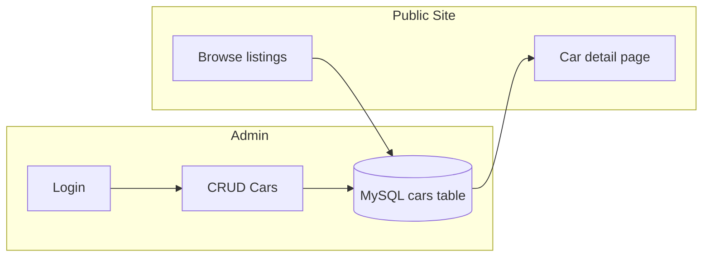
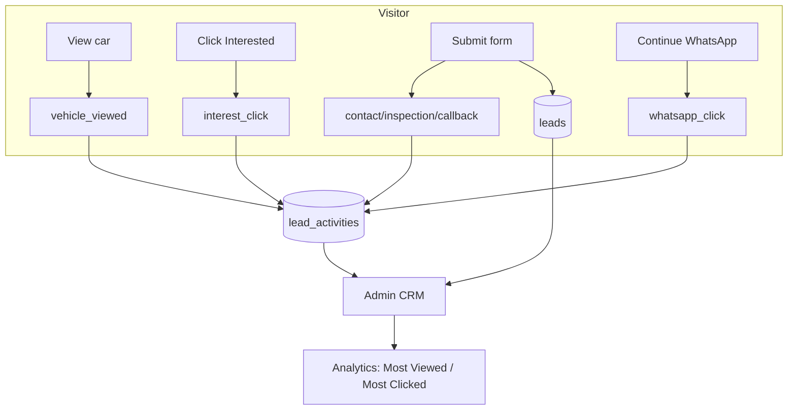

# VA Auto Sales — System Workflow

This document describes how **Stage 1** (foundation listing platform) and **Stage 2** (lead management & CRM) work together, based on `guide.md` and `guide2.md`.

---

## Overview

| Stage | Purpose | Status |
|-------|---------|--------|
| **Stage 1** | Public car listings + admin inventory | Complete |
| **Stage 2** | Lead capture, CRM, buyer tracking, analytics | Complete |

**Stack:** HTML, CSS, JavaScript · PHP · MySQL  
**Folders:** `Frontend/` (public site) · `Backend/` (admin, API, models)

---

## Stage 1 Workflow — Car Listing Platform

### 1. Setup & deployment

```
Install XAMPP → Copy project to htdocs → Run setup.php → Configure app.php & database.php
```

1. Start **Apache** and **MySQL** (XAMPP).
2. Place project in `htdocs/VA_AUT_SALES/` (or upload to hosting root).
3. Visit **`/setup.php`** once — creates database, tables, admin user, sample cars, Stage 2 tables.
4. Update **`Backend/config/app.php`** (site name, WhatsApp number, logo, email).
5. Update **`Backend/config/database.php`** for production MySQL credentials.

### 2. Admin inventory workflow

```
Admin Login → Dashboard → Add/Edit/Delete Cars → Mark Sold/Available → Upload Images (max 5)
```

| Step | Action | URL |
|------|--------|-----|
| 1 | Admin logs in | `Backend/admin/login.php` |
| 2 | View all listings | `Backend/admin/dashboard.php` |
| 3 | Add new car | `Backend/admin/add-car.php` |
| 4 | Edit listing | `Backend/admin/edit-car.php?id={id}` |
| 5 | Delete listing | POST to `delete-car.php` |
| 6 | Toggle status | Available / Sold on edit form |

**Default admin:** `vaautosales` / `vaautosales123` (change after first login)

### 3. Public visitor workflow

```
Homepage → Browse/Filter → Car Detail → Share / Interested / AI Chat
```

| Page | Features |
|------|----------|
| **Homepage** (`Frontend/index.php`) | Hero carousel, quick search, featured cars |
| **Listings** (`Frontend/listings.php`) | Grid layout, filters (brand, year, price, search) |
| **Car detail** (`Frontend/car.php`) | Gallery, specs, description, share link, **Interested in this car?** |

### 4. Stage 1 data flow



---

## Stage 2 Workflow — Lead Management & CRM

### 1. Buyer interest flow (website)

```
Click "Interested in this car?" → Popup form → Submit → Saved to CRM → Continue on WhatsApp
```

| Step | What happens |
|------|----------------|
| 1 | User clicks **Interested in this car?** on homepage card or car detail page |
| 2 | **Popup modal** opens (Request Info / Book Inspection / Request Callback) |
| 3 | User fills name, phone, optional email/budget/message |
| 4 | Form POST → **`Backend/api/leads.php`** → saved to `leads` table |
| 5 | Activity logged in `lead_activities` |
| 6 | Optional email sent to admin (`admin_email` in config) |
| 7 | Success screen → **WhatsApp opens** with prefilled message: |
| | `I'm interested in [Car Name] priced at [Price]` + form details |
| 8 | User taps **Send** in WhatsApp to deliver inquiry to dealership |

### 2. Buyer tracking (automatic)

Every interaction is stored in **`lead_activities`**:

| Activity type | When it fires |
|---------------|---------------|
| `vehicle_viewed` | User opens car detail page OR opens interest modal (once per session per car) |
| `interest_click` | User clicks **Interested in this car?** |
| `whatsapp_click` | User continues to WhatsApp after form submit |
| `contact_request` | Request Info form submitted |
| `inspection_request` | Book Inspection form submitted |
| `callback_request` | Request Callback form submitted |

### 3. Vehicle analytics (admin)

Tracked on **Dashboard** and **Leads (CRM)** pages:

| Metric | Definition |
|--------|------------|
| **Most Viewed Vehicles** | Highest count of `vehicle_viewed` per car |
| **Most Clicked Vehicles** | Highest count of `interest_click` + `whatsapp_click` per car |

Also available:
- Leads by source (Website, WhatsApp, etc.)
- Lead pipeline stats (New → Contacted → Interested → Negotiating → Closed Won/Lost)

### 4. Admin CRM workflow

```
Leads page → Filter/Search → Open lead → Update status → Add notes → Follow up
```

| Step | Action | URL |
|------|--------|-----|
| 1 | Open CRM | `Backend/admin/leads.php` |
| 2 | View stats & vehicle analytics | Top of Leads / Dashboard |
| 3 | Filter by status, source, search | Leads table filters |
| 4 | Open lead detail | `Backend/admin/lead-detail.php?id={id}` |
| 5 | Update pipeline status | New → Contacted → Interested → Negotiating → Closed |
| 6 | Add internal notes | Notes form on lead detail |
| 7 | Call customer | Phone link on lead detail |

### 5. Stage 2 data flow



---

## API Endpoints (Stage 2)

| Method | Endpoint | Purpose |
|--------|----------|---------|
| POST | `Backend/api/leads.php` | Submit lead form |
| POST | `Backend/api/leads.php?action=track` | Log view/click activity |
| GET | `Backend/api/leads.php` | List leads (admin) |
| GET | `Backend/api/leads.php?id=1` | Lead detail (admin) |

---

## Database migrations

Run once (or re-run `setup.php`):

| File | Purpose |
|------|---------|
| `database/schema.sql` | Stage 1 — cars, admins |
| `database/migrate_stage2.sql` | Leads, notes, activities |
| `database/migrate_vehicle_analytics.sql` | Adds `interest_click` activity type |

Or from CLI:

```bash
php scripts/migrate-stage2.php
php scripts/migrate-vehicle-analytics.php
```

---

## File map (key paths)

```
VA_AUT_SALES/
├── Frontend/
│   ├── index.php, listings.php, car.php
│   ├── includes/lead-modal.php    ← Interest popup forms
│   └── assets/js/leads.js         ← Tracking + modal logic
├── Backend/
│   ├── admin/dashboard.php        ← Inventory + vehicle analytics
│   ├── admin/leads.php            ← CRM + vehicle analytics
│   ├── api/leads.php              ← Lead capture API
│   └── models/Lead.php            ← CRM + analytics queries
├── guide.md                       ← Stage 1 specification
├── guide2.md                      ← Stage 2 specification
└── work_flow.md                   ← This document
```

---

## End-to-end example

1. **Admin** adds a 2022 Toyota Camry via dashboard.
2. **Visitor** finds it on homepage → clicks **Interested in this car?**
3. System logs **interest_click** (+ **vehicle_viewed** if first time).
4. Visitor submits **Request Info** form → lead saved, email sent to admin.
5. WhatsApp opens: *"I'm interested in 2022 Toyota Camry priced at ₦18,500,000"* + contact details.
6. **Admin** opens **Leads** → sees new lead → marks **Contacted** → adds note → calls buyer.
7. **Analytics** show Camry rising in **Most Viewed** and **Most Clicked** rankings.

---

## Future enhancements (optional)

- WhatsApp Business API (automated replies)
- SMS notifications
- Lead export (CSV)
- Role-based admin permissions
- Charts/graphs for analytics trends over time
